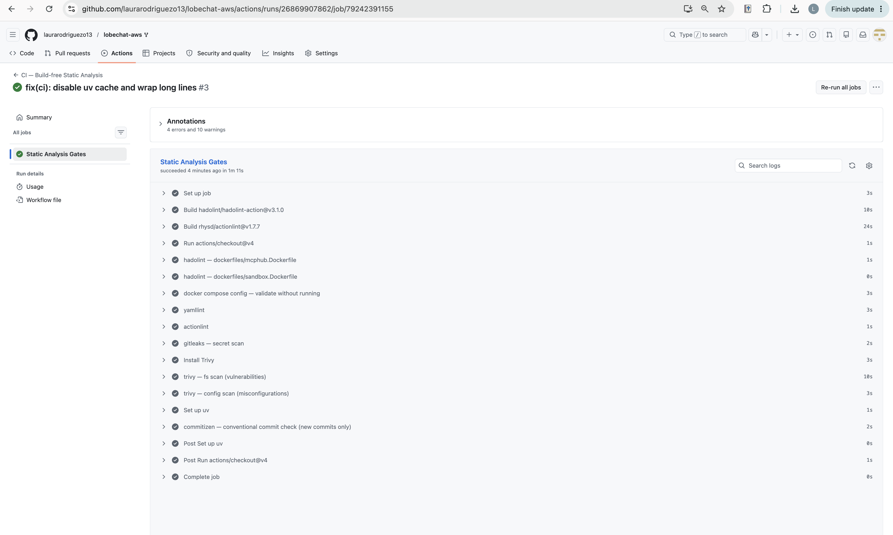

# CI Reasoning — Build-free Static Analysis Pipeline

## Evidence

<!-- Screenshot of the GitHub Actions run — added after first push -->

**Actions run URL:** https://github.com/laurarodriguezo13/lobechat-aws/actions/runs/26869907862/job/79242391155  
**Commit SHA:** f83cbf7

---

## Part A — Why what I did matters (repository-specific)

This pipeline runs entirely without starting the application. The full stack is
build-free by necessity: `vllm` declares a GPU `devices` reservation and a
`start_period: 300s` healthcheck; combined with the 11-service dependency graph,
it cannot run on a standard GitHub-hosted runner. The pipeline therefore applies
only static gates — tools that read files rather than execute them.

`tests/` are explicitly excluded. `tests/test_vllm.py` imports `openai` and
`httpx` and calls live endpoints (`http://localhost:47007/v1/models`,
`http://localhost:47012/docs`). These endpoints do not exist in CI; running
`pytest` here would always fail and violates the exam's hard rule.

The `${VAR}` interpolation fix (`cp .env.example .env`) is safe because
`.env.example` contains only placeholder strings (e.g.
`OPENROUTER_API_KEY=sk-or-v1-your-openrouter-api-key`) and `.gitignore` already
excludes `.env`, so the copy is never committed. No real secret reaches the
runner or the repository.

### Gate-by-gate risk analysis

#### 1. hadolint — `dockerfiles/mcphub.Dockerfile`

**File:** `dockerfiles/mcphub.Dockerfile`

- **Line 1** — `FROM samanhappy/mcphub:latest`: floating `:latest` tag means
  every CI run may pull a different upstream image. A supply-chain attack or a
  breaking upstream change silently enters the build. hadolint surfaces this as
  `DL3007` (avoid `:latest` tag).
- **Line 5** — `USER root`: the image never drops privileges before the `CMD`.
  Any process inside the running `mcphub` container (which has Docker socket
  access, see `docker-compose.yml:100`) runs as root — a container escape would
  immediately give host-root access.
- **Line 7** — `apt-get install -y docker.io gcc`: `docker.io` and a C compiler
  are build-time dependencies being baked into the runtime image, unnecessarily
  expanding the attack surface of every deployed container.

#### 2. hadolint — `dockerfiles/sandbox.Dockerfile`

**File:** `dockerfiles/sandbox.Dockerfile`

- **Lines 43–44** — kubectl downloaded via
  `curl https://dl.k8s.io/release/$(curl stable.txt)/…`: the inner `curl` resolves
  the version at build time with no checksum verification. A MITM or a
  compromised upstream could substitute a malicious binary.
- **Lines 49–50** — eksctl downloaded from
  `github.com/eksctl-io/eksctl/releases/latest/…`: same pattern — `latest`
  redirect with no pinned version or SHA verification.
- **Lines 62** — zellij downloaded from
  `github.com/zellij-org/zellij/releases/latest/…`: identical unverified
  download pattern.
- **Line 21** — `echo 'oriol ALL=(ALL) NOPASSWD:ALL'`: grants passwordless
  root-equivalent sudo inside the sandbox container. Combined with the
  bind-mounted `~/.ssh` (see `docker-compose.yml`), any code running in this
  sandbox can escalate and reach the host.

#### 3. docker compose config — `docker-compose.yml` unpinned images

**File:** `docker-compose.yml`

- **Line 19** — `image: lobehub/lobe-chat-database` (no tag at all): the most
  dangerous case — Docker resolves this to `:latest` implicitly. LobeChat is the
  user-facing service; an uncontrolled upstream update could break the
  application silently on the next `docker compose pull`.
- **Line 105** — `image: qdrant/qdrant:latest`: Qdrant holds the RAG vector
  store. An unpinned pull could change the storage format and corrupt the
  `rag-demo` collection on restart.
- **Line 176** — `image: minio/minio:latest`: MinIO stores all user-uploaded
  files. An unpinned update could change the API or bucket policy enforcement.

#### 4. trivy config — `docker-compose.yml` TLS disabled

**File:** `docker-compose.yml`

- **Line 11** — `sslmode=disable` on Casdoor's Postgres DSN: Casdoor (the SSO
  provider) connects to PostgreSQL over plaintext. Any network-level observer on
  the Docker bridge can read authentication tokens and session data.
- **Line 28** — `DATABASE_URL=postgresql://postgres:…@postgres:5432/lobechat`:
  LobeChat's database URL specifies no TLS parameters either. All chat history,
  API keys (encrypted by `KEY_VAULTS_SECRET`), and user data transit unencrypted
  between the app and the database.

#### 5. trivy config / gitleaks — secrets as plaintext env vars + AWS bind-mount

**File:** `docker-compose.yml`

- **Line 49** — `KEY_VAULTS_SECRET=${KEY_VAULTS_SECRET}`: the master encryption
  key for all stored API keys is injected as a plain environment variable. Any
  process in the `lobe-chat` container, or a tool with `docker inspect` access,
  can read it in cleartext.
- **Line 99** — `~/.aws:/root/.aws:ro`: the host's long-lived AWS credentials
  are bind-mounted into the `mcphub` container. If `mcphub` is compromised
  (recall it also has the Docker socket), the attacker gets persistent AWS access
  with whatever permissions the host profile carries — no rotation, no scope
  limit.

#### 6. commitizen check — `pyproject.toml` existing gate mirrored

The repo already enforces Conventional Commits locally via
`.githooks/commit-msg` (uses `--commit-msg-file`). That file path does not exist
in CI, so the CI gate uses `--rev-range origin/main..HEAD` to lint only the new
commits on this branch, mirroring the local gate without re-running it on the
full history of pre-existing non-compliant commits.

---

## Part B — What is missing for a real production CI/CD (delivery) pipeline

What was built above is **Continuous Integration**: a set of static quality and
security gates that run on every push. The workflow stops well short of
**Continuous Delivery or Deployment** — it never builds an image, never pushes
an artifact, never touches the EC2 instance, and never verifies that a new
version actually works. Below are the concrete gaps, grounded in this
repository.

### 1. Build, push, sign, and SBOM the locally-built images

`dockerfiles/mcphub.Dockerfile` and `dockerfiles/sandbox.Dockerfile` are built
locally with `docker compose build` before deployment. There is no CI step that
builds these images, tags them with an immutable digest, and pushes them to a
registry (e.g. ECR `800762439306.dkr.ecr.eu-west-1.amazonaws.com`). Without
this, every deployment re-builds on the EC2 instance from a mutable `:latest`
base — if the base changes between the CI scan and the deploy, the scan result
is worthless. A real pipeline builds once, signs the image (Cosign/Sigstore),
generates an SBOM, and every downstream stage uses the same immutable digest.

### 2. Federate to AWS via GitHub OIDC — no long-lived keys

`docker-compose.yml:99` bind-mounts `~/.aws:/root/.aws:ro` into `mcphub`. The
`.env.example` contains commented placeholders for `AWS_ACCESS_KEY_ID`,
`AWS_SECRET_ACCESS_KEY`, and `AWS_SESSION_TOKEN`. This pattern — static,
long-lived AWS credentials on the deployment host — means a single host
compromise gives permanent AWS access with no automatic rotation. A production
pipeline replaces this with a GitHub OIDC trust relationship: CI jobs assume an
IAM role with a short-lived token scoped to exactly the actions needed (ECR
push, SSM run-command), and no standing credentials ever exist.

### 3. Inject secrets at deploy time from SSM Parameter Store / Secrets Manager

Secrets today live in `.env` on the EC2 instance (excluded from git by
`.gitignore`). There is no mechanism to rotate them, audit access, or inject
them securely into CI. A real pipeline stores `KEY_VAULTS_SECRET`,
`NEXT_AUTH_SECRET`, `OPENROUTER_API_KEY`, and the Casdoor secrets in AWS SSM
Parameter Store (SecureString) or Secrets Manager, and the deploy step fetches
them at runtime — never baked into an image or sitting in a file on disk.

### 4. Database migration stage with guarded `clean`

The repo has a full migration toolchain at `db/migrations/` (dbmate, run via
`db/migrate`). There is currently no CI/CD stage that runs pending migrations
against the target database before the new containers come up. More critically,
`db/flyway/provision.sh` contains a `clean` command that **drops all data** —
there is nothing preventing an accidental or malicious execution of that command
in an automated pipeline. A real pipeline adds an explicit migration job with a
dry-run step, and gates the destructive `clean` behind a manual approval in a
protected GitHub environment.

### 5. Environment promotion with manual approval

The final project has a single environment (the EC2 instance at
`54-72-107-165.sslip.io`). A production system needs at minimum dev → stage →
prod: the CI run gates entry to each environment, and production promotion
requires a manual approval step in a GitHub protected environment. This prevents
a bad commit from reaching the live URL automatically.

### 6. Automated deploy mechanism to EC2

There is currently no deploy step at all. The `progress.md` documents that
deployment is done manually via SSH (`ssh ubuntu@54.72.107.165`). A real pipeline
adds a deploy job that uses SSM Run Command (preferred — no open SSH port needed)
or SSH with a short-lived key to: pull the new images by digest, run
`docker compose up -d`, and run the migrations. Port 47000 stays closed from the
public internet; only Caddy's 443 is exposed, which is already the case in the
current security group.

### 7. Post-deploy smoke tests and health gates

Several services in `docker-compose.yml` have no `healthcheck` defined (notably
`lobe-chat` at line 19 and `hayhooks`). After a deploy, the pipeline has no way
to verify the stack actually came up correctly. A real pipeline runs
`tests/test_vllm.py` and `tests/test_hayhooks.py` against an ephemeral
environment (or the stage environment) — these are the live-stack integration
tests deliberately excluded from the static CI. Passing them gates the promotion
to production.

### 8. Automated rollback and immutable deploy units

`docker-compose.yml:23` has a commented-out bind-mount of `patches/route.js` —
a ~3 MB monkeypatch applied directly to the running LobeChat container. This
means the deploy unit is a combination of an unpinned image plus a committed
blob, making rollback manual (SSH in, revert the file, restart the container). A
real pipeline bakes `patches/route.js` into a forked, version-tagged image at
build time, so a rollback is simply `docker compose pull` of the previous image
digest and `docker compose up -d`.

### 9. Branch protection and signed release tags

The `main` branch currently has no required status checks. Any push merges
without the CI gates passing. A real setup enables branch protection rules
requiring the static-analysis job to pass, enforces signed commits for release
tags (the `final-vX.Y.Z` pattern already used by `cz bump`), and prevents
direct pushes to `main`.

---

### Prioritisation — the single highest-value next step

**Federate to AWS via GitHub OIDC and replace the `~/.aws` bind-mount.**

Everything else (image builds, deploys, migrations) requires CI to interact with
AWS. The current pattern — long-lived credentials bound into a container that
also has Docker socket access (`docker-compose.yml:100`) — is a single point of
catastrophic compromise. Fixing this one change (OIDC trust + scoped IAM role)
removes the standing-credential risk, enables all subsequent automation steps,
and costs nothing beyond an IAM configuration change. It is the unlock for the
entire CD pipeline.
