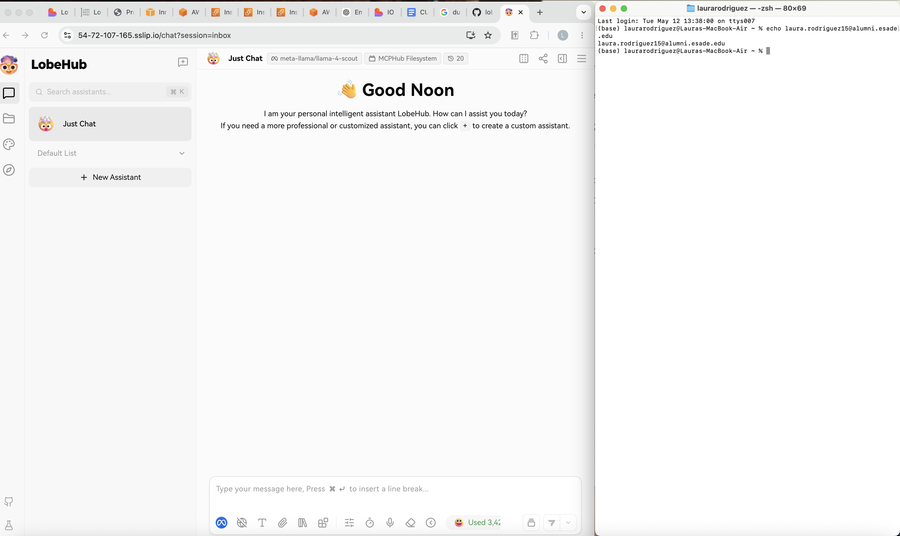
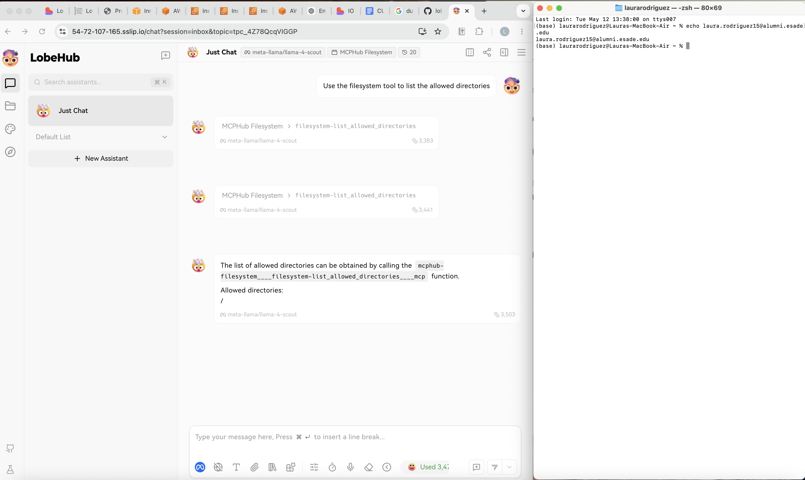

# Final Project — Evidence Report

## 1. Identity

| Field | Value |
|---|---|
| Student name | Laura Rodriguez Ortega |
| ESADE email | laura.rodriguez15@alumni.esade.edu |
| GitHub repo URL | https://github.com/laurarodriguezo13/lobechat-aws (private; `joseporiolrius` invited as collaborator) |
| Latest commit SHA | `2e774ce6ad9026baa0a2394375d5b404911acaaa` |
| Final tag | `final-v0.6.0` |

## 2. Public URL

**[https://54-72-107-165.sslip.io](https://54-72-107-165.sslip.io)**

## 3. Screenshot — LobeChat over HTTPS, logged in



## 4. Screenshot — chat working (streaming + MCP)



## 5. Public reachability — `curl -sI https://<host>/`

```
$ curl -sI https://54-72-107-165.sslip.io/
# Tue May 12 11:49:00 CEST 2026
HTTP/2 307
alt-svc: h3=":443"; ma=2592000
date: Tue, 12 May 2026 09:49:00 GMT
location: /chat
via: 1.1 Caddy
```

## 6. Negative test — port 47000 closed

```
$ curl -v --max-time 5 http://54.72.107.165:47000/
# Tue May 12 01:56:24 CEST 2026
  % Total    % Received % Xferd  Average Speed   Time    Time     Time  Current
                                 Dload  Upload   Total   Spent    Left  Speed
  0     0    0     0    0     0      0      0 --:--:-- --:--:-- --:--:--     0
* Trying 54.72.107.165:47000...
* Connection timed out after 5006 milliseconds
curl: (28) Connection timed out after 5006 milliseconds
```

## 7. Stack runtime — `docker compose ps`

```
$ docker compose ps
# Tue May 12 11:49:05 UTC 2026
NAME              IMAGE                               COMMAND                  SERVICE         CREATED        STATUS                    PORTS
casdoor           casbin/casdoor:v2.13.0              "/server /bin/sh -c …"   casdoor         13 hours ago   Up 22 minutes             127.0.0.1:47092->8000/tcp
hayhooks          deepset/hayhooks:v1.1.0             "hayhooks run --host…"   hayhooks        13 hours ago   Up 22 minutes             0.0.0.0:47012->1416/tcp, [::]:47012->1416/tcp
hayhooks-mcp      deepset/hayhooks:v1.1.0             "sh -c 'pip install …"   hayhooks-mcp    13 hours ago   Up 22 minutes             1416/tcp, 0.0.0.0:47013->1417/tcp, [::]:47013->1417/tcp
linux-sandbox     lobechat-aws-linux-sandbox:latest   "tail -f /dev/null"      linux-sandbox   13 hours ago   Up 22 minutes
lobe-chat         lobehub/lobe-chat-database          "/bin/node /app/star…"   lobe-chat       11 hours ago   Up 22 minutes             0.0.0.0:47000->3210/tcp, [::]:47000->3210/tcp
mcphub            lobechat-aws-mcphub:latest          "/usr/local/bin/entr…"   mcphub          12 hours ago   Up 22 minutes             0.0.0.0:47008->3000/tcp, [::]:47008->3000/tcp
minio             minio/minio:latest                  "/usr/bin/docker-ent…"   minio           13 hours ago   Up 22 minutes (healthy)   0.0.0.0:47005->9000/tcp, [::]:47005->9000/tcp, 0.0.0.0:47006->9001/tcp, [::]:47006->9001/tcp
qdrant            qdrant/qdrant:latest                "./entrypoint.sh"        qdrant          13 hours ago   Up 22 minutes (healthy)   0.0.0.0:47010->6333/tcp, [::]:47010->6333/tcp, 0.0.0.0:47011->6334/tcp, [::]:47011->6334/tcp
shared-postgres   pgvector/pgvector:pg16              "docker-entrypoint.s…"   postgres        13 hours ago   Up 22 minutes (healthy)   0.0.0.0:47003->5432/tcp, [::]:47003->5432/tcp
vllm              python:3.11-alpine                  "python3 -m http.ser…"   vllm            13 hours ago   Up 22 minutes (healthy)   0.0.0.0:47007->8000/tcp, [::]:47007->8000/tcp
```
