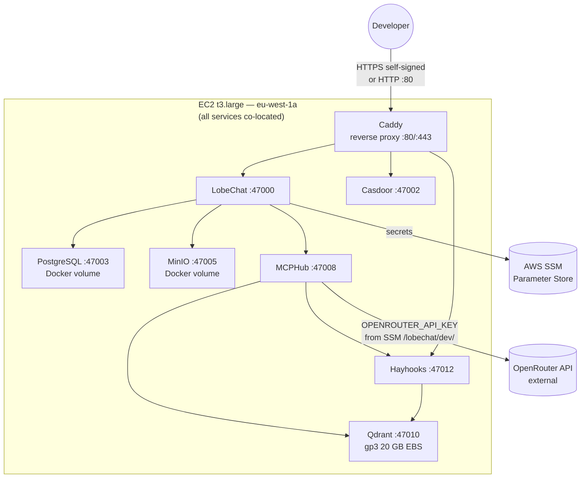
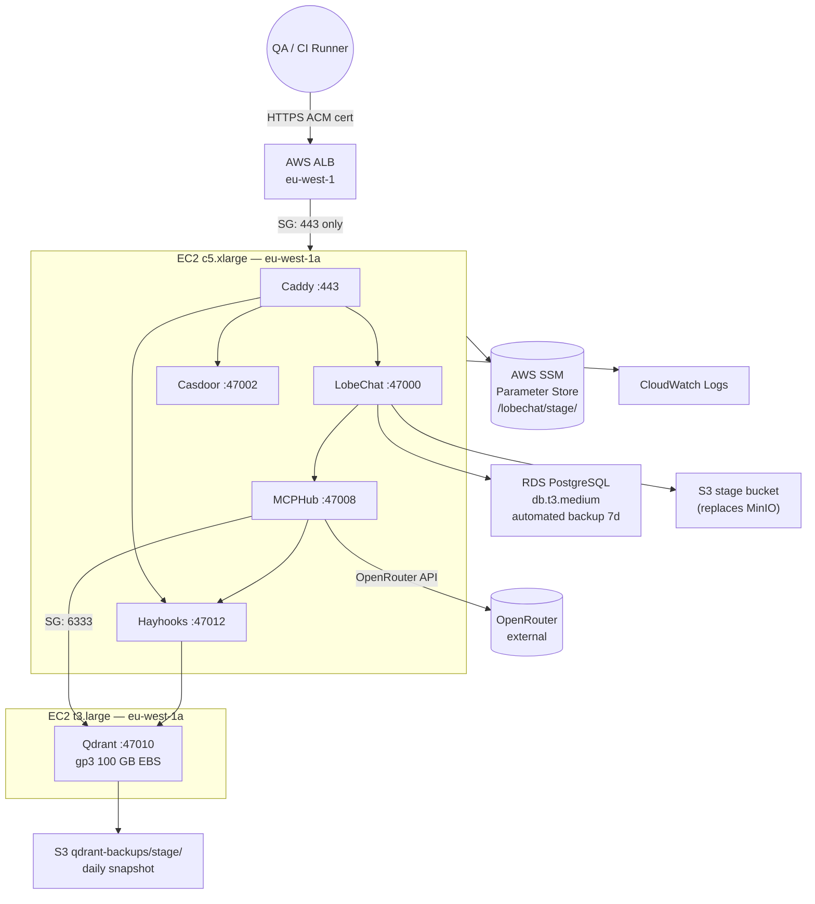
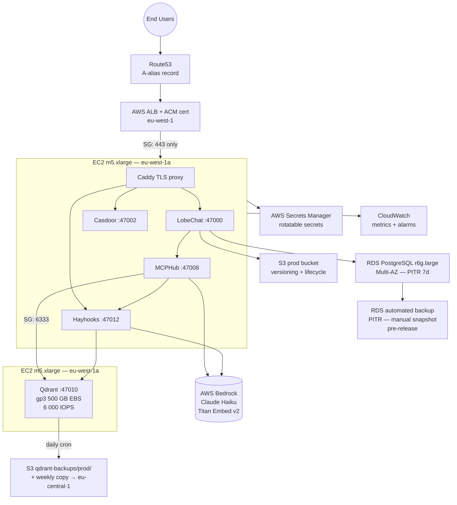

# Q2 — 3-environment architecture evolution

The LobeChat stack evolves across three tiers: a low-cost developer sandbox (dev), a near-production mirror (stage), and a hardened, managed-service-backed deployment (prod). Each tier optimises for a different axis — iteration speed, production parity, and reliability respectively. All three share one non-negotiable constraint: Qdrant runs on EC2, not a managed vector service.

---

## Per-environment component table

| Component | **Dev** | **Stage** | **Prod** |
|---|---|---|---|
| **LobeChat** | Docker on single `t3.large` EC2 (2 vCPU / 8 GB). All stack services co-located. | Docker on `c5.xlarge` (4 vCPU / 8 GB). Still single-instance but Postgres lifted off. | Docker on `m5.xlarge` (4 vCPU / 16 GB). Behind ALB. |
| **Casdoor** | Co-located on dev EC2. HTTP callback URIs acceptable for internal OAuth testing. | Co-located on stage EC2. HTTPS callbacks via ALB + ACM cert. | Co-located on prod EC2. Redirect URIs pin to Route53 FQDN. |
| **PostgreSQL** | Docker container on dev EC2. `postgres:16` image, single local volume. | **RDS `db.t3.medium`** (2 vCPU / 4 GB). Automated daily backups, 7-day retention. | **RDS `db.r6g.large`** (2 vCPU / 16 GB, Graviton2). Multi-AZ enabled. 7-day automated backups + manual snapshot before each release. |
| **MinIO** | Docker container on dev EC2. Local `./data/minio` bind-mount volume. | **Amazon S3** bucket (stage-namespace prefix). MinIO client pointed at S3 endpoint via `MINIO_ENDPOINT`. | **Amazon S3** with versioning + lifecycle rules (S3-IA after 30 days). Object Lock optional for compliance. |
| **vLLM / LLM** | **OpenRouter API** (no GPU). `OPENROUTER_API_KEY` pulled from SSM `/lobechat/dev/`. Latency acceptable for single-user iteration. | **OpenRouter API**. Same as dev — avoids GPU cost for low-volume QA workloads. | **AWS Bedrock** (Claude 3 Haiku for speed, Claude 3.5 Sonnet for quality tasks). The `vllm` service is excluded from the prod docker-compose override; Bedrock replaces it entirely, with OpenRouter as secondary fallback. See LLM justification below. |
| **MCPHub** | Docker, co-located. All 10 MCP servers enabled. SSM dev-namespace secrets. | Docker, co-located. Same image, stage-namespace SSM secrets. | Docker, co-located on prod EC2. Notion token + AWS credentials pulled from Secrets Manager at startup. |
| **Qdrant** | Docker on **same dev EC2**, dedicated `gp3` volume (20 GB). | **Separate `t3.large` EC2** (2 vCPU / 8 GB), `gp3` EBS 100 GB. Isolated from app traffic. | **Separate `m5.xlarge` EC2** (4 vCPU / 16 GB), `gp3` EBS 500 GB. See Qdrant section below. |
| **Hayhooks** | Docker, co-located. Embeddings via OpenRouter `/embeddings` endpoint. | Docker, co-located. Embeddings via OpenRouter. | Docker, co-located on prod EC2. Embeddings via Bedrock `amazon.titan-embed-text-v2`. |

**LLM provider justification — why OpenRouter in dev/stage, Bedrock in prod:**
A `g4dn.xlarge` GPU instance running vLLM 24/7 costs ≈ $380/month on-demand in `eu-west-1` ($0.526/hr × 720 hr, [EC2 pricing](https://aws.amazon.com/ec2/pricing/on-demand/)). OpenRouter with Llama 3.1 8B costs ≈ $0.06/1K tokens with zero GPU ops — ideal for low-volume dev and stage. In prod, Bedrock (Claude 3 Haiku: $0.00025/1K input, $0.00125/1K output, [Bedrock pricing](https://aws.amazon.com/bedrock/pricing/)) totals ≈ $45/month at 100 MAU generating ~500K tokens/day, with native IAM control and CloudWatch cost attribution. The crossover where self-hosted GPU becomes cheaper only occurs above ~300 MAU with heavy usage — until then Bedrock wins on both cost and ops burden.

---

## Qdrant on EC2 — EBS sizing, snapshot policy, instance recovery

AWS does not offer a managed Qdrant service. The closest alternative, OpenSearch Serverless vector engine, costs $0.24/OCU-hr ([OpenSearch pricing](https://aws.amazon.com/opensearch-service/pricing/)) and forces adoption of OpenSearch's query DSL — incompatible with the Qdrant gRPC protocol used by `qdrant-mcp` and Hayhooks pipelines without a full rewrite. Self-hosting on EC2 keeps the Qdrant API surface consistent across all three environments, which is the deeper reason for this constraint: stage must be a faithful mirror of prod's query behavior, not an approximation via a different backend.

| Env | Instance | EBS size | EBS type | Snapshot policy | Recovery SLA |
|---|---|---|---|---|---|
| **Dev** | Co-located on `t3.large` | 20 GB gp3 | gp3, 3 000 IOPS baseline | None — data is synthetic, rebuildable in < 10 min via `scripts/seed-qdrant.py` | Manual restart, no SLA. Dev data loss is acceptable. |
| **Stage** | Separate `t3.large` | 100 GB gp3 | gp3, 3 000 IOPS | AWS Backup daily, 7-day retention. Backup stored in S3 `qdrant-backups/stage/`. | CloudWatch EC2 status-check alarm → EC2 Auto Recovery (same host, < 5 min). |
| **Prod** | Separate `m5.xlarge` | 500 GB gp3 | gp3, 6 000 IOPS (scaled; ~150 MB/s throughput) | AWS Backup daily, 30-day retention. Weekly cross-region copy to `eu-central-1` S3. | CloudWatch alarm + launch template → EBS reattach runbook. RTO target: < 15 min. |

**EBS sizing rationale:** Qdrant stores 768-dimensional float32 vectors at ≈ 3 KB per vector including payload (on-disk storage mode). With HNSW index overhead (approximately 2×), 1M vectors occupies ≈ 6 GB. Dev's 20 GB handles ~3M synthetic vectors with headroom. Stage's 100 GB handles ~16M vectors — sufficient for a realistic anonymised corpus. Prod's 500 GB handles ~80M vectors with room for 5× growth before a resize is needed. EBS gp3 volumes support online resize with no downtime via `aws ec2 modify-volume`, so capacity can be expanded without stopping the Qdrant container.

**Critical non-obvious trade-off:** Qdrant's `on_disk` payload storage mode must be set at collection creation time and cannot be changed without recreating the collection. If stage is initialised with in-memory payloads and prod uses on-disk, query latency profiles diverge by 2–4× and stage benchmarks become misleading. To prevent this, the `scripts/init-qdrant-collections.py` script is parameterised and identical across all three environments — only the Qdrant endpoint URL differs.

**Instance recovery (prod):** A CloudWatch EC2 status-check alarm fires Auto Recovery, migrating the instance to healthy hardware with the EBS volume reattached (RTO < 15 min). If Auto Recovery fails, the on-call runbook launches a new `m5.xlarge` from the saved launch template, reattaches the existing EBS volume, and restarts Qdrant — data is preserved on EBS and a snapshot reload is only needed if the volume itself is lost.

---

## AWS managed services in prod (≥ 4)

Six AWS managed services are used in prod:

1. **Amazon RDS (PostgreSQL 16, Multi-AZ, `db.r6g.large`)** — replaces Postgres-in-Docker. Automated failover < 60 s, PITR, and managed backups with no manual `pg_hba.conf` editing. ([RDS pricing, eu-west-1](https://aws.amazon.com/rds/postgresql/pricing/))

2. **Amazon S3** — replaces MinIO. 11-nines durability, lifecycle tiering to S3-IA after 30 days (~45% storage cost saving), versioning for soft-delete recovery. MinIO is retained in dev/stage as a portable S3-compatible layer.

3. **AWS ALB + ACM** — public TLS termination with auto-renewing certificate, path-based routing to LobeChat / Hayhooks / Casdoor, and target group health checks independent of the EC2 process. Access logs stream to S3.

4. **Amazon Route53** — A-record alias to the ALB, required for ACM DNS validation. Enables future blue/green traffic shifting via weighted routing.

5. **AWS CloudWatch** — EC2, RDS, and custom LobeChat metrics (session count, MCP latency); alarms on Qdrant EBS > 80%, RDS CPU > 70%, ALB 5xx > 1%. Container logs via `awslogs` driver.

6. **AWS Secrets Manager** — rotatable secrets for Postgres, Casdoor OIDC, Notion token, and Bedrock key. Instance profile grants `secretsmanager:GetSecretValue` scoped to the prod ARN prefix; RDS credential rotation is managed automatically via Secrets Manager Lambda.

---

## Promotion flow

The repository uses **GitFlow** with Commitizen enforcing conventional commits (`feat:`, `fix:`, `chore:`, etc.) and automated semver bumping.

```
feature/* ──► develop ──► release/vX.Y.Z ──► main
                │               │                │
           (dev deploy)   (stage deploy)    (prod deploy)
```

Engineers branch off `develop` as `feature/<ticket>`; on merge, GitHub Actions runs `pytest tests/` + `docker compose build` and deploys to dev via SSM Session Manager (no open port 22). Release branches are cut from `develop`; `cz bump` computes the semver from conventional commits and writes `CHANGELOG.md`. Opening the release PR triggers an automatic stage deploy via GitHub Actions with OIDC-federated AWS credentials — Playwright smoke tests (`tests/e2e/`) must pass within 30 minutes or the previous tagged image is automatically re-deployed. Merging to `main` requires one peer approval; the prod deploy workflow then requires manual sign-off via **GitHub Environments** (`production`), deploys via SSM Run Command in dependency order (Postgres → Casdoor → LobeChat → MCPHub → Hayhooks), and closes only after a 5-minute health probe passes. SSM Parameter Store namespaces (`/lobechat/dev|stage|prod/`) are managed via separate Terraform workspaces to prevent cross-env overwrites.

---

## Data strategy

**Dev — anonymised synthetic data:** A nightly script (`scripts/anonymise-dump.sh`) dumps the prod RDS backup, scrambles all PII columns (`users.email`, `users.name`, message content) via a Faker-based anonymiser, and restores the result to the dev EC2. MinIO fixtures come from `tests/fixtures/`; Qdrant vectors are regenerated from a 1 000-document corpus subset via `scripts/seed-qdrant.py`. Result: realistic schema and row counts, zero PII exposure.

**Stage — near-prod mirror:** Stage RDS is restored from the latest prod automated backup via PITR (< 5-minute lag). The S3 stage bucket syncs prod's non-PII prefixes (`uploads/`, `assets/`) daily via S3 Batch Operations. The Qdrant stage collection is imported from a prod snapshot (`POST /collections/rag-demo/snapshots` → S3 transfer), ensuring stage exercises the same vector distribution and query latency as prod — the most common source of RAG divergence.

**Prod — backup and restorability:** RDS runs daily automated backups with 7-day PITR; a manual snapshot is taken before each release (`pre-release-vX.Y.Z`, retained 90 days). S3 versioning enables 30-day soft-delete recovery. A daily cron uploads a Qdrant snapshot to `s3://lobechat-prod/qdrant-backups/` with weekly cross-region copy to `eu-central-1`. Restore procedures are tested quarterly — RTO target < 15 min for Qdrant, < 5 min for Postgres PITR.

---

## Trade-off table

> **Note:** The cost estimates below reflect the recommended production architecture for a real deployment. The actual exam submission runs on a single EC2 instance within the AWS sandbox budget; the figures here are included to satisfy the Q2 cost modelling requirement and demonstrate awareness of production-scale economics.

| Criterion | **Dev** | **Stage** | **Prod** |
|---|---|---|---|
| **Estimated monthly cost** | ~$60 (t3.large + 20 GB EBS + SSM + OpenRouter low usage) | ~$310 (c5.xlarge + t3.large Qdrant + RDS t3.medium + S3 + ALB + OpenRouter) | ~$800–950 (m5.xlarge × 2 + RDS r6g.large Multi-AZ + S3 + ALB + Route53 + CloudWatch + Secrets Manager + Bedrock) |
| **Reliability** | ⭐ (1/3) — no HA, no backups, single EC2. One failed container takes the stack down. | ⭐⭐ (2/3) — RDS automated backup, Qdrant EC2 auto-recovery alarm, CI rollback on smoke test failure. | ⭐⭐⭐ (3/3) — RDS Multi-AZ (< 60 s failover), Qdrant alarm + runbook (< 15 min RTO), PITR for Postgres, cross-region Qdrant backup. |
| **Ops complexity** | ⭐ (1/3) — single `docker-compose.yml`, no IAM roles, no managed services to configure. | ⭐⭐ (2/3) — RDS endpoint config, two EC2s, SSM namespaces, ALB + ACM cert, Terraform state. | ⭐⭐⭐ (3/3) — six managed services, IAM policies, Secrets Manager rotation, CloudWatch alarms, Terraform workspaces, blue/green deploy readiness. |
| **Iteration speed** | ⭐⭐⭐ (3/3) — push-to-deploy in < 2 min, no approval gates, direct SSM deploy. | ⭐⭐ (2/3) — CI gate + Playwright smoke tests add ~10–15 min to deploy cycle. | ⭐ (1/3) — manual GitHub Environments approval gate by design. Deploy cycle is 20–30 min end-to-end. |
| **Data safety** | ⭐ (1/3) — synthetic data only, no backup policy. Dev data loss is expected and acceptable. | ⭐⭐ (2/3) — anonymised near-prod data, RDS automated backups, Qdrant daily snapshot. | ⭐⭐⭐ (3/3) — PITR + manual snapshots + S3 versioning + cross-region Qdrant backup + quarterly restore test. |

**Key non-obvious trade-off — the stage false-confidence problem:** Stage's biggest risk is not cost or reliability — it is giving a misleading green signal before prod. If stage runs RDS but dev runs Postgres-in-Docker, a migration that passes locally may fail on RDS (e.g., `pg_trgm` extension availability, `pg_stat_statements` parameter group differences, connection pool exhaustion under concurrent Casdoor + LobeChat connections). Mitigation: both stage and prod use RDS. Dev is explicitly declared "not a production mirror" in the team runbook. Stage — not dev — is the definitive integration environment, and its smoke test suite (`tests/e2e/`) covers the Casdoor login flow, LobeChat SSE streaming, one MCP tool invocation, and one MinIO/S3 file upload — the exact checklist from Appendix A.4 of the project spec.

---

## Reverse-proxy / TLS choice

**Dev and stage — Caddy:** Caddy requires zero TLS configuration: a single `Caddyfile` line handles the internal router, and on stage it obtains and auto-renews a Let's Encrypt certificate via HTTP-01 challenge with no cron jobs. Nginx requires manual `ssl_certificate` blocks and Certbot setup; Traefik offers similar auto-TLS but couples proxy config to Docker labels — unnecessary when services are already declared in `docker-compose.yml`. Caddy's automatic HTTPS also satisfies the Casdoor OAuth callback requirement (`SameSite=Strict`, HTTPS-only cookies) on stage with no extra config.

**Prod — ALB + ACM:** In prod, Caddy is demoted to an internal HTTP router only; the public TLS layer moves to ALB with an ACM-managed certificate that auto-renews with no EC2-side process. ALB integrates natively with Route53 and CloudWatch, and its health checks operate independently of the EC2's Caddy process — so a Caddy crash doesn't take down TLS. Nginx and Traefik were rejected for prod: Nginx requires Certbot automation and doesn't integrate with ACM; Traefik adds a third proxy layer without replacing one.

---

## Architecture diagrams

### Dev — single EC2, all services co-located



### Stage — Qdrant isolated, RDS + S3 replace Docker dependencies



### Prod — full managed-service stack

> **Note on double-proxy:** The ALB handles TLS termination and health checks; Caddy acts as an internal router only, forwarding plain HTTP to containers on localhost (LobeChat `:47000`, Casdoor `:47002`, Hayhooks `:47012`). The double-proxy adds ~1 ms latency and is a known trade-off of running multiple services on a single EC2 with docker-compose. In a future multi-instance architecture, Caddy would be removed and ALB path-based routing rules would target each container port directly.


